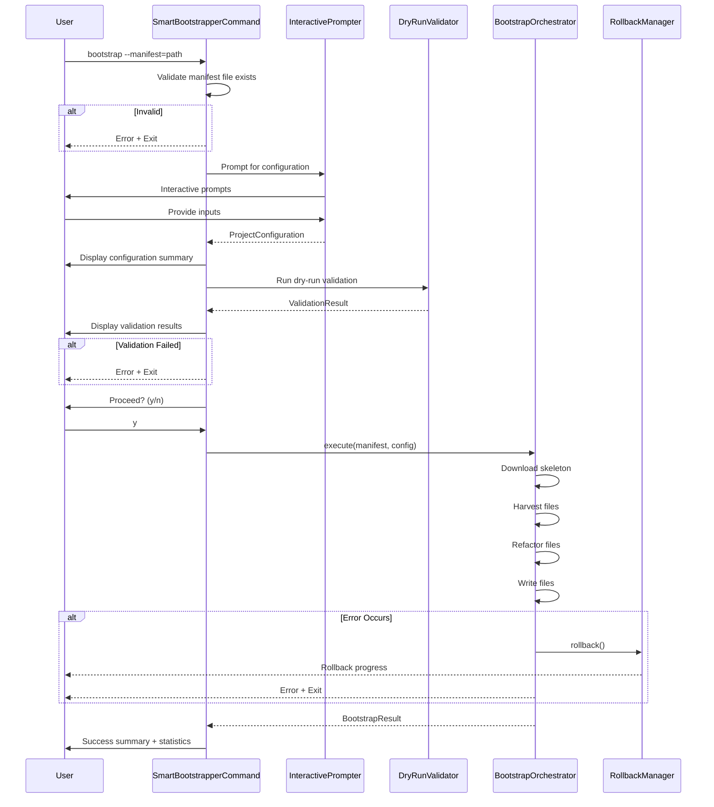

I have created the following plan after thorough exploration and analysis of the codebase. Follow the below plan verbatim. Trust the files and references. Do not re-verify what's written in the plan. Explore only when absolutely necessary. First implement all the proposed file changes and then I'll review all the changes together at the end.

## Observations

The repository is currently empty (only `file:Instruction.md` exists), indicating a greenfield project. The spec defines SmartBootstrapper as a CLI tool that automates Spring Boot project setup through manifest-driven file harvesting from Git history with package refactoring. The tool requires interactive prompts, comprehensive validation, detailed progress feedback, and automatic rollback on errors. Key technical challenges include Git repository interaction, Java source code parsing/refactoring, Spring Initializr integration, and YAML manifest processing.

## Approach

The implementation follows a modular architecture with clear separation of concerns: CLI layer for user interaction, validation layer for dry-run checks, core services for Git operations and refactoring, and orchestration layer for workflow management. The approach prioritizes fail-fast validation, explicit user input without defaults, transparent progress feedback, and clean rollback on errors. The tool will be built as a standalone Java CLI application using industry-standard libraries for Git operations (JGit), YAML parsing, Java code manipulation (JavaParser), and interactive CLI (Picocli/JLine).

## Implementation Plan

### 1. Project Setup and Build Configuration

**Create Maven project structure** with standard directory layout:
- Set up `pom.xml` with Java 21, Spring Boot parent for dependency management
- Configure Maven Shade plugin to create executable JAR with all dependencies
- Add `.gitignore` for Java/Maven artifacts
- Define project coordinates: `com.smartbootstrapper:smartbootstrapper-cli:1.0.0`

**Add core dependencies**:
- `picocli` (4.7.x) - CLI framework with annotations and interactive prompts
- `org.eclipse.jgit` (6.x) - Git repository operations
- `snakeyaml` (2.x) - YAML manifest parsing
- `com.github.javaparser:javaparser-core` (3.25.x) - Java source code parsing and manipulation
- `okhttp` (4.x) - HTTP client for Spring Initializr API
- `commons-io` (2.x) - File operations and utilities
- `slf4j-api` + `logback-classic` - Logging framework
- `junit-jupiter` (5.x) - Testing framework

### 2. Domain Model and Data Structures

**Create manifest model** in `file:src/main/java/com/smartbootstrapper/model/`:
- `ManifestEntry` - Represents single file entry with commit hash, source path, destination path
- `Manifest` - Container for manifest entries with validation methods
- `ProjectConfiguration` - Holds user inputs (groupId, artifactId, name, version, dependencies, oldPackage, newPackage)

**Create result/status models**:
- `ValidationResult` - Encapsulates validation outcome with error details
- `HarvestResult` - Statistics about harvested files
- `RefactorResult` - Statistics about refactored files
- `BootstrapResult` - Overall operation result with summary

### 3. Manifest Parser and Validator

**Implement manifest parsing** in `file:src/main/java/com/smartbootstrapper/manifest/`:
- `ManifestParser` - Reads YAML file and converts to `Manifest` object
- Handle YAML parsing errors with line numbers and context
- Validate manifest structure (required fields, format)
- Detect duplicate destination paths

**Implement manifest validator** in `ManifestValidator`:
- Check file existence and readability
- Validate YAML syntax with detailed error messages
- Verify manifest contains at least one entry
- Return `ValidationResult` with actionable error messages

### 4. Git Repository Operations

**Create Git service** in `file:src/main/java/com/smartbootstrapper/git/`:
- `GitRepositoryService` - Wrapper around JGit for repository operations
- `openRepository(path)` - Opens Git repository with error handling
- `commitExists(commitHash)` - Verifies commit exists in repository
- `getFileContent(commitHash, filePath)` - Retrieves file content from specific commit
- `getFileAtCommit(commitHash, filePath)` - Returns file as byte array
- Handle Git errors (repository not found, commit not found, file not found)

**Implement file harvester** in `GitFileHarvester`:
- `harvestFiles(manifest, repository)` - Iterates through manifest entries
- Retrieves each file from specified commit
- Returns map of destination path to file content
- Provides progress callback for CLI feedback
- Collects detailed error information for validation

### 5. Java Code Refactoring Engine

**Create refactoring service** in `file:src/main/java/com/smartbootstrapper/refactor/`:
- `PackageRefactorService` - Handles package name refactoring
- `refactorJavaFile(content, oldPackage, newPackage)` - Uses JavaParser to:
  - Parse Java source code into AST
  - Update package declaration
  - Update import statements
  - Update fully qualified class references
  - Return refactored source code as string
- Handle parse errors with line numbers and context

**Create resource refactoring** in `ResourceRefactorService`:
- `refactorPropertiesFile(content, oldPackage, newPackage)` - Refactor application.properties/yml
- `refactorXmlFile(content, oldPackage, newPackage)` - Refactor XML configuration files
- Use regex-based replacement for non-Java files
- Preserve file formatting and comments

**Implement refactor orchestrator** in `RefactorOrchestrator`:
- Determines file type (Java, XML, properties, other)
- Routes to appropriate refactoring service
- Handles files that don't need refactoring (resources, static files)
- Returns `RefactorResult` with statistics

### 6. Spring Initializr Integration

**Create Initializr client** in `file:src/main/java/com/smartbootstrapper/initializr/`:
- `SpringInitializrClient` - HTTP client for start.spring.io API
- `downloadSkeleton(config)` - Builds request with:
  - Group ID, artifact ID, name
  - Spring Boot version, Java version
  - Dependencies list
  - Packaging type (jar)
- Downloads ZIP file to temporary location
- Returns path to downloaded file

**Implement skeleton extractor** in `SkeletonExtractor`:
- `extractSkeleton(zipPath, targetDirectory)` - Unzips skeleton
- Validates ZIP structure
- Extracts to target directory
- Handles extraction errors

### 7. Validation Engine (Dry-Run)

**Create comprehensive validator** in `file:src/main/java/com/smartbootstrapper/validation/`:
- `DryRunValidator` - Orchestrates all validation checks
- `validateManifestStructure(manifest)` - Checks manifest format
- `validateGitRepository(repoPath)` - Verifies repository accessibility
- `validateCommitsExist(manifest, repository)` - Checks all commits exist
- `validateFilesExist(manifest, repository)` - Checks all files exist in commits
- `validateJavaFiles(manifest, repository)` - Attempts to parse all Java files
- Returns detailed `ValidationResult` with checklist and error details

**Implement validation result formatter** in `ValidationResultFormatter`:
- Formats validation results for CLI display
- Shows checklist with ✓/✗ symbols
- Displays error details with context (commit, file, line, reason)
- Groups related errors

### 8. File Writer and Rollback Manager

**Create file writer** in `file:src/main/java/com/smartbootstrapper/writer/`:
- `ProjectFileWriter` - Writes harvested and refactored files
- `writeFile(path, content)` - Writes file with directory creation
- Tracks all written files for rollback
- Provides progress callback for CLI feedback

**Implement rollback manager** in `RollbackManager`:
- Tracks all filesystem changes (created directories, written files)
- `recordChange(path, changeType)` - Records each change
- `rollback()` - Reverses all changes in reverse order
- Removes created files and empty directories
- Provides progress feedback during rollback

### 9. Interactive CLI Layer

**Create main CLI command** in `file:src/main/java/com/smartbootstrapper/cli/`:
- `SmartBootstrapperCommand` - Main Picocli command class
- `@Command` annotation with name "smartbootstrapper"
- `bootstrap` subcommand with `--manifest` option
- Entry point: `public static void main(String[] args)`

**Implement interactive prompter** in `InteractivePrompter`:
- `promptForConfiguration()` - Collects all user inputs
- `promptGroupId()` - Prompts with format validation and suggestions
- `promptArtifactId()` - Prompts with format validation
- `promptProjectName()` - Simple text prompt
- `promptSpringBootVersion()` - Prompts with version format validation
- `promptJavaVersion()` - Prompts with version validation
- `promptDependencies()` - Multi-select checkbox list using JLine3
- `promptOldPackage()` - Prompts for package to refactor from
- Uses JLine3 for rich terminal interactions
- Validates input inline with ✓/✗ feedback
- Provides suggestions for invalid input

**Create input validators** in `InputValidator`:
- `validateGroupId(input)` - Checks lowercase with dots format
- `validateArtifactId(input)` - Checks lowercase with hyphens format
- `validatePackageName(input)` - Checks valid Java package format
- `validateVersion(input)` - Checks semantic version format
- Returns validation result with suggestions

**Implement configuration display** in `ConfigurationDisplay`:
- `displaySummary(config)` - Shows formatted configuration summary
- `displayValidationResults(results)` - Shows validation checklist
- `displayConfirmationPrompt()` - Shows "Proceed? (y/n)" prompt

### 10. Progress Feedback System

**Create progress tracker** in `file:src/main/java/com/smartbootstrapper/progress/`:
- `ProgressTracker` - Manages multi-phase progress display
- `startPhase(phaseNumber, totalPhases, description)` - Begins new phase
- `reportSubTask(description)` - Reports completed sub-task with ✓
- `reportError(description)` - Reports error with ✗
- Uses ANSI escape codes for colored output
- Thread-safe for concurrent operations

**Implement statistics collector** in `StatisticsCollector`:
- Tracks operation metrics (files harvested, refactored, copied)
- Tracks timing information
- `generateSummary()` - Creates final summary report
- Formats summary with bullet points and statistics

### 11. Bootstrap Orchestrator

**Create main orchestrator** in `file:src/main/java/com/smartbootstrapper/orchestrator/`:
- `BootstrapOrchestrator` - Coordinates entire bootstrap workflow
- `execute(manifest, config)` - Main execution method:
  1. Initialize rollback manager
  2. Download Spring Boot skeleton (Phase 1/4)
  3. Extract skeleton to target directory
  4. Validate manifest and repository (Phase 2/4)
  5. Harvest files from Git history (Phase 3/4)
  6. Refactor and write files (Phase 4/4)
  7. Generate and display summary
- Wraps execution in try-catch for error handling
- Triggers rollback on any exception
- Returns `BootstrapResult`

**Implement error handler** in `ErrorHandler`:
- Catches and categorizes exceptions
- Formats error messages with context
- Triggers rollback with progress feedback
- Ensures clean exit with appropriate status codes

### 12. Main Application Flow

**Wire components in main command** (`SmartBootstrapperCommand`):

**Implementation steps**:
1. Parse command-line arguments with Picocli
2. Validate manifest file immediately
3. Create `InteractivePrompter` and collect configuration
4. Display configuration summary
5. Create `DryRunValidator` and run validation
6. Display validation results
7. If validation fails, exit with error
8. Prompt for confirmation
9. If user declines, exit cleanly
10. Create `BootstrapOrchestrator` and execute
11. Handle errors with rollback
12. Display success summary or error message

### 13. Configuration and Logging

**Create application configuration** in `file:src/main/resources/`:
- `application.properties` - Default configuration
- `logback.xml` - Logging configuration (console output only for CLI)
- Configure log levels (INFO for user feedback, DEBUG for troubleshooting)

**Define constants** in `file:src/main/java/com/smartbootstrapper/Constants.java`:
- Spring Initializr API URL
- Default timeout values
- ANSI color codes for terminal output
- Validation regex patterns
- Error message templates

### 14. Error Handling Strategy

**Define exception hierarchy** in `file:src/main/java/com/smartbootstrapper/exception/`:
- `SmartBootstrapperException` - Base exception
- `ManifestException` - Manifest parsing/validation errors
- `GitException` - Git repository operation errors
- `RefactorException` - Code refactoring errors
- `InitializrException` - Spring Initializr download errors
- `ValidationException` - Validation failure errors
- Each exception includes context fields for detailed error messages

**Implement exception handlers**:
- Catch exceptions at orchestrator level
- Format error messages with context
- Trigger rollback automatically
- Log detailed error information
- Display user-friendly error messages

### 15. Testing Strategy

**Unit tests** in `file:src/test/java/com/smartbootstrapper/`:
- Test manifest parsing with valid/invalid YAML
- Test Git operations with mock repository
- Test package refactoring with sample Java files
- Test validation logic with various scenarios
- Test input validation with valid/invalid inputs
- Use JUnit 5 and Mockito for mocking

**Integration tests**:
- Test complete bootstrap flow with test Git repository
- Test rollback functionality
- Test error scenarios end-to-end
- Use temporary directories for file operations

**Test fixtures**:
- Sample manifest files (valid, invalid, edge cases)
- Sample Java files for refactoring tests
- Mock Git repository with test commits

### 16. Build and Packaging

**Configure Maven Shade plugin** in `pom.xml`:
- Create uber JAR with all dependencies
- Set main class to `SmartBootstrapperCommand`
- Configure transformers for service files
- Exclude unnecessary dependencies

**Create executable script** in `file:smartbootstrapper`:
- Shell script wrapper for easy execution
- Sets Java options (heap size, etc.)
- Executes JAR with arguments
- Make script executable

**Build process**:
1. `mvn clean compile` - Compile sources
2. `mvn test` - Run tests
3. `mvn package` - Create executable JAR
4. Test executable: `java -jar target/smartbootstrapper-cli-1.0.0.jar bootstrap --manifest=test.yaml`

### 17. Documentation

**Create README.md** with:
- Project overview and features
- Installation instructions
- Usage examples with sample manifest
- Manifest file format specification
- Troubleshooting guide
- Contributing guidelines

**Create sample manifest** in `file:examples/sample-manifest.yaml`:
- Example with multiple file entries
- Comments explaining each field
- Different file types (Java, properties, XML)

**Create user guide** in `file:docs/USER_GUIDE.md`:
- Detailed walkthrough of bootstrap process
- Configuration options explained
- Validation error reference
- Best practices for manifest creation

## Implementation Order

1. **Foundation** (Steps 1-2): Project setup, dependencies, domain models
2. **Core Services** (Steps 3-6): Manifest parsing, Git operations, refactoring, Initializr client
3. **Validation** (Step 7): Dry-run validation engine
4. **Infrastructure** (Steps 8, 14): File writer, rollback manager, exception handling
5. **CLI Layer** (Steps 9-10): Interactive prompts, progress feedback
6. **Orchestration** (Steps 11-12): Bootstrap orchestrator, main application flow
7. **Configuration** (Step 13): Application configuration, constants
8. **Testing** (Step 15): Unit and integration tests
9. **Packaging** (Step 16): Build configuration, executable creation
10. **Documentation** (Step 17): README, user guide, examples