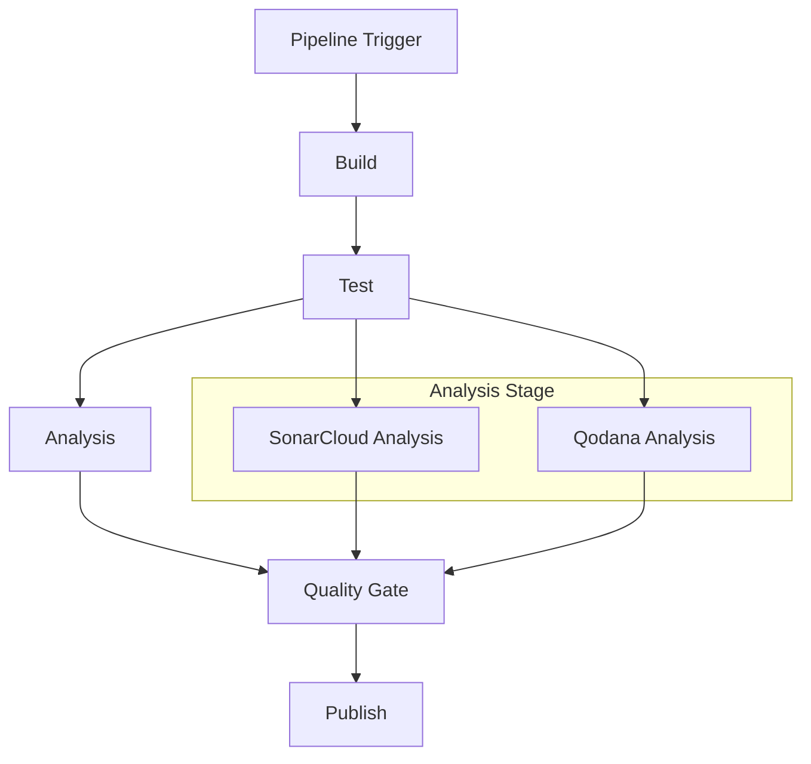
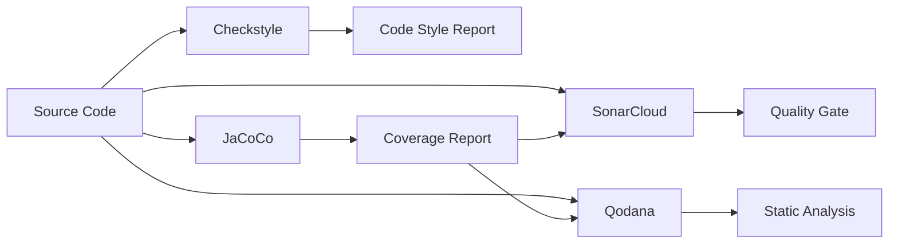
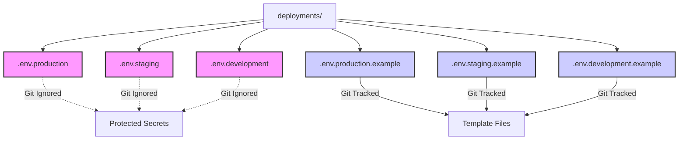
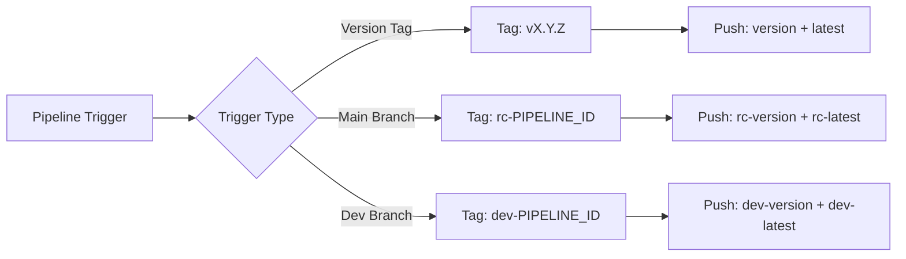

# Deployment and CI/CD

This document describes the continuous integration, quality analysis, and deployment processes for the project.

## GitLab CI/CD Pipeline

The project implements a comprehensive GitLab CI/CD pipeline with multiple stages for building, testing, code analysis, quality gating, and publishing.

### Pipeline Stages



### Stage Details

#### 1. Build Stage
- **Image**: `maven:3.9-eclipse-temurin-21`
- **Purpose**: Compiles the Java application using Maven
- **Artifacts**: `target/` directory cached for 1 hour

#### 2. Test Stage
- **Image**: `maven:3.9-eclipse-temurin-21`
- **Purpose**: Executes unit and integration tests with coverage reporting
- **Coverage Tool**: JaCoCo integration

#### 3. Analysis Stage
**SonarCloud Analysis:**
- Configures different parameters for merge requests vs branch analysis
- Integrates with JaCoCo for code coverage reporting
- Waits for quality gate results

**Qodana Analysis:**
- Uses GitLab CI component: `qodana/qodana-gitlab-ci@v2025.2`
- Configured with custom settings for JVM projects
- Supports MR comments and result upload

#### 4. Quality Gate Stage
- **Purpose**: Validates quality metrics from multiple sources (SonarCloud, JaCoCo)
- **Failure Conditions**: Any check below 80% coverage threshold fails the pipeline

#### 5. Publish Stage
- **Purpose**: Builds and publishes Docker images to Docker Hub
- **Tagging Strategy**: `latest`, `rc-latest`, `dev-latest`

---

## Quality Analysis Configuration

The system integrates multiple quality analysis tools to ensure code quality, security, and maintainability.

### Analysis Tools Stack



### Integration Details
- **Checkstyle**: Enforces code style during `validate` phase.
- **JaCoCo**: Generates coverage reports (XML/HTML) for Qodana and SonarCloud.
- **SonarCloud**: Centralized quality gate and code analysis.
- **Qodana**: JetBrains static analysis tool integrated into CI.

---

## Docker Deployment Configuration

### Environment Variables Management

The project includes enhanced Docker deployment configuration with improved environment variable management.

#### Key Changes:
- **Protected Environment Files**: All `.env*` files in the `deployments/` directory are ignored by Git.
- **Template Preservation**: Example environment templates (`deployments/.env*.example`) are explicitly tracked.

#### Environment File Structure:


#### Usage Instructions:

1. **For New Deployments**:
   ```bash
   # Copy the appropriate template
   cp deployments/.env.production.example deployments/.env.production
   
   # Edit with your specific values
   nano deployments/.env.production
   ```

2. **Environment File Naming Convention**:
   - `deployments/.env.production` - Production environment
   - `deployments/.env.staging` - Staging environment  
   - `deployments/.env.development` - Development environment

3. **Security Notes**:
   - Never commit actual `.env` files to version control.
   - Keep example files updated with required variable names.

#### Docker Integration:
These environment files are automatically loaded by Docker Compose when using the deployment configurations. This allows for environment-specific database connections, API keys, and secrets.

---

## Observability Stack

The project includes a comprehensive observability stack for monitoring, logging, and tracing, specifically optimized for k6 load testing.

### Core Components
- **Prometheus**: Metrics collection and storage.
- **Grafana**: Visualization and dashboards.
- **Loki**: Log aggregation.
- **Tempo**: Distributed tracing.
- **k6**: Load testing engine.

### Documentation
- [Observability Stack Overview](./observability-stack.md)
- [Grafana Dashboards](./grafana-dashboards.md)

---

## Docker Image Building

### Tagging Strategy:


### Build Command:
```bash
docker build \
    --file deployments/Dockerfile \
    --tag "$DOCKERHUB_USERNAME/$IMAGE_NAME:$VERSION" \
    --tag "$DOCKERHUB_USERNAME/$IMAGE_NAME:$LATEST_TAG" \
    .
```