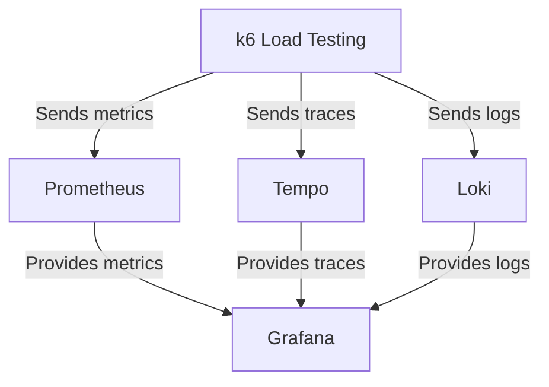
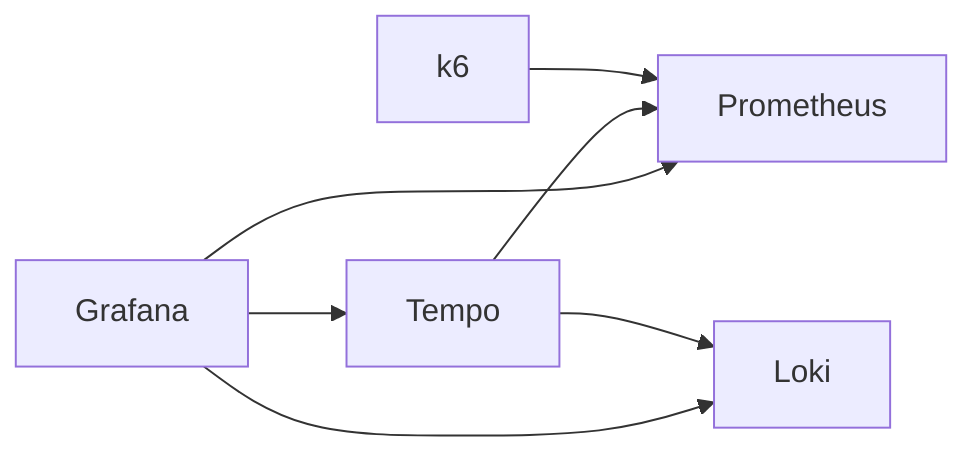

# Observability Stack

This document describes the Docker Compose-based observability stack that provides monitoring, logging, tracing, and load testing capabilities.

## Overview

The observability stack consists of five core services that work together to provide comprehensive application monitoring:



## Service Configuration

### 1. Prometheus (Metrics Collection)

**Purpose**: Time-series database for collecting and storing metrics from k6 load tests.

**Configuration**:
- **Image**: `prom/prometheus:latest`
- **Port**: `9090`
- **Volume Mounts**:
  - `./prometheus.yaml` → `/etc/prometheus/prometheus.yml`
  - `prometheus_data` → `/prometheus`
- **Key Features**:
  - Remote write receiver enabled for k6 metrics
  - Cross-platform host resolution via `extra_hosts`
  - Persistent storage for metrics data

### 2. Grafana (Visualization)

**Purpose**: Dashboard platform for visualizing metrics, logs, and traces.

**Configuration**:
- **Image**: `grafana/grafana:latest`
- **Port**: `3000`
- **Default Credentials**:
  - Username: `vernon`
  - Password: `password`
- **Volume Mounts**:
  - `grafana_data` → `/var/lib/grafana`
  - `./provisioning/datasources` → `/etc/grafana/provisioning/datasources`
  - `./provisioning/dashboards` → `/etc/grafana/provisioning/dashboards`
  - `./dashboards` → `/var/lib/grafana/dashboards`

### 3. Loki (Log Aggregation)

**Purpose**: Horizontally-scalable, highly-available log aggregation system.

**Configuration**:
- **Image**: `grafana/loki:latest`
- **Port**: `3100`
- **Volume Mounts**:
  - `./loki.yaml` → `/etc/loki/local-config.yaml`
  - `loki_data` → `/tmp/loki`

### 4. Tempo (Distributed Tracing)

**Purpose**: High-volume, minimal-dependency distributed tracing backend.

**Configuration**:
- **Image**: `grafana/tempo:latest`
- **Ports**:
  - `3200` - Tempo API
  - `4317` - OTLP gRPC
  - `4318` - OTLP HTTP
- **Volume Mounts**:
  - `./tempo.yaml` → `/etc/tempo.yaml`
  - `tempo_data` → `/tmp/tempo`

### 5. k6 (Load Testing)

**Purpose**: Modern load testing tool that sends metrics directly to Prometheus.

**Configuration**:
- **Image**: `grafana/k6:latest`
- **Port**: `6565`
- **Environment Variables**:
  - `K6_PROMETHEUS_RW_SERVER_URL`: `http://prometheus:9090/api/v1/write`
  - `K6_PROMETHEUS_RW_TREND_AS_NATIVE_HISTOGRAM`: `true`
- **Volume Mounts**:
  - `./k6` → `/scripts`
- **Command**: Runs test scripts with Prometheus remote write output

## Data Flow

1. **k6 Execution**: Load tests generate metrics, logs, and traces
2. **Metrics Flow**: k6 → Prometheus (via remote write API)
3. **Logs Flow**: k6 → Loki
4. **Traces Flow**: k6 → Tempo
5. **Visualization**: Grafana queries all three data sources for unified observability

## Dashboard Features

The included `k6-dashboard.json` provides:

### Performance Overview
- Virtual Users (VUs) over time
- HTTP request duration quantiles (p95, p99, etc.)
- Requests per second (RPS)
- Error rates

### Key Metrics
- **HTTP Requests**: Total request count
- **HTTP Request Failures**: Failed request count
- **Peak RPS**: Maximum requests per second
- **HTTP Request Duration**: Response time quantiles

### Detailed Analysis
- **Transfer Rate**: Data sent/received over time
- **Iteration Metrics**: Test iteration duration and dropped iterations
- **HTTP Latency Timings**: Breakdown of HTTP request phases:
  - Blocked time
  - TLS handshaking
  - Sending time
  - Waiting time
  - Receiving time

## Usage

### Starting the Stack
```bash
cd grafana
docker-compose up -d
```

### Accessing Services
- **Grafana**: http://localhost:3000 (user: vernon, password: password)
- **Prometheus**: http://localhost:9090
- **Loki**: http://localhost:3100
- **Tempo**: http://localhost:3200

### Running Load Tests
```bash
# Place your k6 test scripts in the ./k6 directory
# The k6 container will automatically run test.js
# Or execute manually:
docker exec -it local-k6 k6 run /scripts/your-test.js
```

## Configuration Files

The stack requires the following configuration files (not included in this diff):
- `prometheus.yaml` - Prometheus configuration
- `loki.yaml` - Loki configuration
- `tempo.yaml` - Tempo configuration
- `./provisioning/datasources/*` - Grafana datasource definitions
- `./provisioning/dashboards/*` - Grafana dashboard provisioning

## Persistence

All services use Docker volumes for data persistence:
- `prometheus_data`: Prometheus metrics storage
- `grafana_data`: Grafana configuration and dashboards
- `loki_data`: Loki log storage
- `tempo_data`: Tempo trace storage

## Dependencies



- Grafana depends on Prometheus for metrics
- Tempo depends on both Loki and Prometheus
- k6 depends on Prometheus for metrics storage
