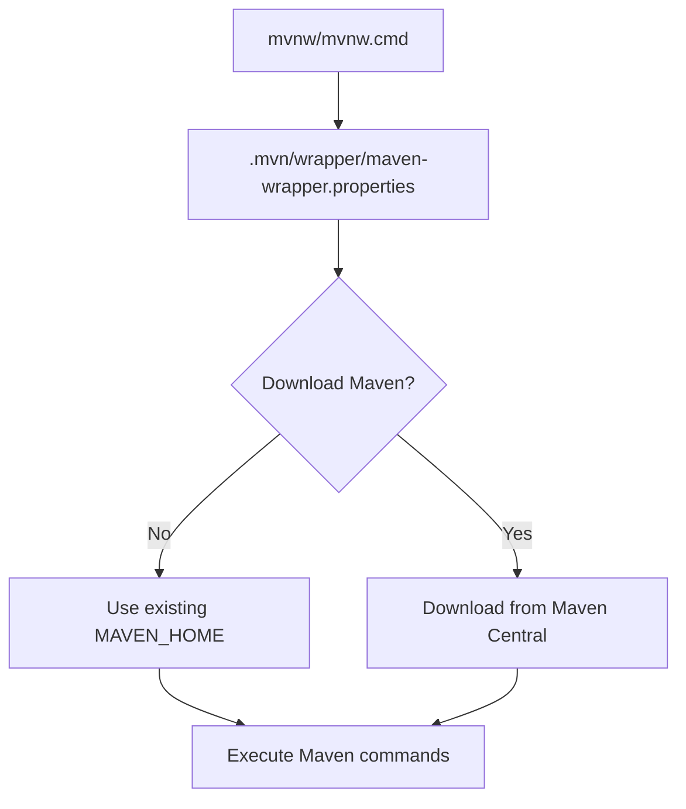

### FILE: 04-operations/setup.md
## Development Environment Setup

This project uses a standard Java/Spring Boot development environment with Maven as the build tool.

### Prerequisites

- **Java 21** or higher
- **Maven** (automatically managed via Maven Wrapper)

### Project Structure

```
.
├── .mvn/                    # Maven wrapper configuration
├── src/                     # Source code
│   ├── main/java/com/upmatches/app/
│   │   └── UpmatchesApplication.java  # Main application class
│   └── test/java/com/upmatches/app/
│       └── UpmatchesApplicationTests.java  # Test class
├── pom.xml                  # Maven project configuration
├── mvnw                     # Unix/Linux Maven wrapper script
├── mvnw.cmd                 # Windows Maven wrapper script
└── .gitattributes           # Git line ending configuration
```

### Build System

The project uses **Maven Wrapper** (version 3.3.4) which ensures consistent builds across different environments without requiring Maven to be pre-installed.

#### Maven Wrapper Configuration



**Key Files:**
- `mvnw` / `mvnw.cmd`: Platform-specific wrapper scripts
- `.mvn/wrapper/maven-wrapper.properties`: Maven distribution configuration
- `.gitattributes`: Ensures consistent line endings across platforms

#### Build Commands

```bash
# Build the project
./mvnw clean compile

# Run tests
./mvnw test

# Package the application
./mvnw package

# Run the application
./mvnw spring-boot:run
```

### IDE Configuration

The project includes IDE-specific ignore patterns in `.gitignore` for:
- **IntelliJ IDEA** (`.idea/`, `*.iml`)
- **Eclipse/STS** (`.project`, `.classpath`, `.settings/`)
- **VS Code** (`.vscode/`)
- **NetBeans** (`nbproject/`, `build/`)

### Application Configuration

**Main Configuration File:** `src/main/resources/application.properties`
```properties
spring.application.name=upmatches
```

### Testing

The project includes a basic Spring Boot test configuration:
- Test class: `UpmatchesApplicationTests`
- Uses `@SpringBootTest` annotation
- Located in `src/test/java/com/upmatches/app/`

### Dependencies

Core dependencies defined in `pom.xml`:
- **Spring Boot Starter** (4.0.1)
- **Spring Boot Starter Test** (test scope)
- **Java 21** compatibility

### Git Configuration

The `.gitattributes` file ensures consistent line endings:
- Unix line endings (`LF`) for shell scripts (`mvnw`)
- Windows line endings (`CRLF`) for batch files (`*.cmd`)

### Getting Started

1. Clone the repository
2. Ensure Java 21 is installed
3. Run `./mvnw spring-boot:run` to start the application
4. Access the application at `http://localhost:8080`

The Maven wrapper will automatically download the required Maven version (3.9.12) on first run if not already available in the local cache.